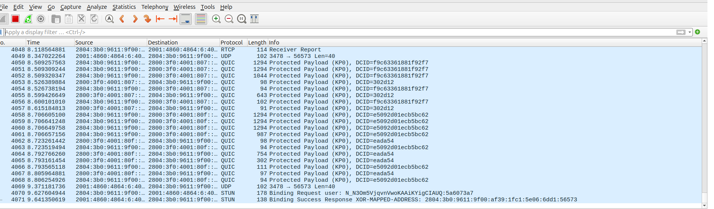
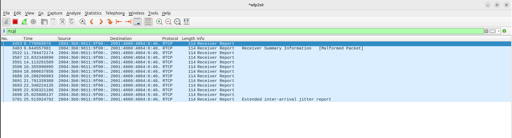
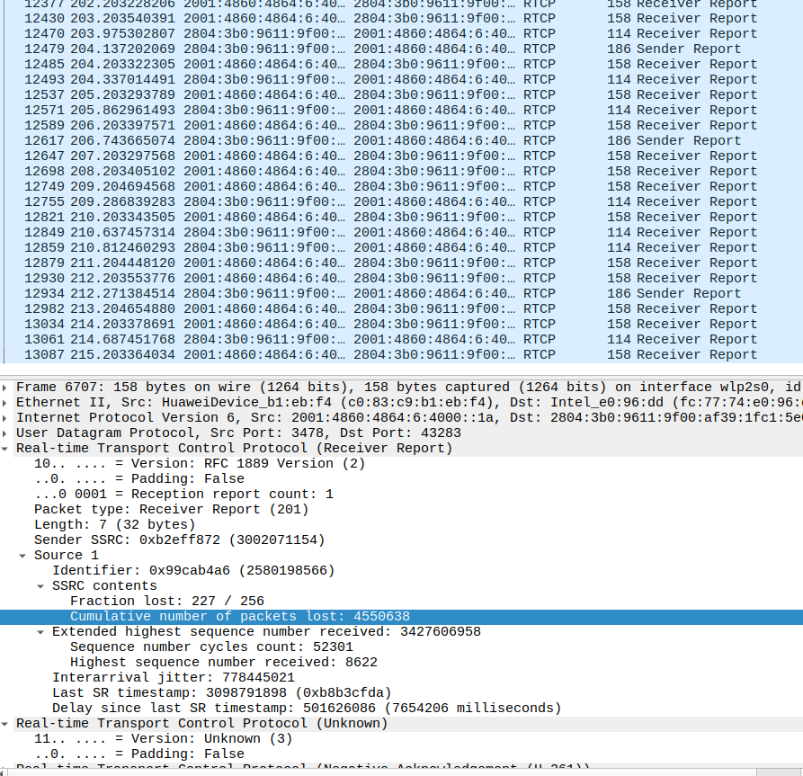
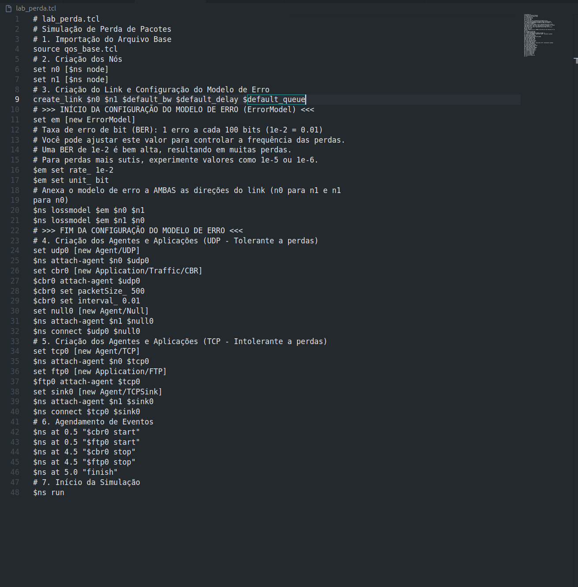

# Relatório de Laboratório: Qualidade de Serviço (QoS) - A Otimização da Jornada dos Pacotes

**Disciplina:** Redes de Computadores II
**Professora:** Angelita Rettore de Araujo

**Nome do Aluno:** Otávio Lunardelli de Giacometti

**Turma:** 6ª fase

---

## 1. Introdução

Este laboratório aborda a **Qualidade de Serviço (QoS)**, um conjunto de mecanismos importantes para gerenciar o tráfego de rede e assegurar que aplicações críticas recebam tratamento preferencial. Diferente dos laboratórios anteriores que focaram na confiabilidade (garantir que os pacotes cheguem), o objetivo aqui é garantir que os pacotes cheguem *com qualidade* – ou seja, com a latência, jitter, throughput e perda de pacotes adequados.

A importância da QoS é contextualizada pela **narrativa da telecirurgia**, onde cada pacote de comando tátil, voz ou dado vital do paciente é crucial. Atrasos, variações irregulares na chegada ou perda de pacotes podem ter consequências catastróficas.

## 2. Objetivos

Os principais objetivos deste laboratório são:
1.  **Compreender e medir** os conceitos fundamentais de Latência, Jitter, Throughput, Perda de Pacotes e Classificação de Tráfego no contexto de QoS.
2.  **Configurar e executar simulações** no **Network Simulator 2 (NS2)** para observar o comportamento da rede sob diferentes condições de QoS.
3.  **Utilizar o Wireshark** para capturar e analisar o tráfego de rede, medindo parâmetros de QoS em tempo real.
4.  **Analisar o impacto** da variação dos parâmetros de QoS no desempenho de diferentes tipos de aplicações.
5.  **Comparar a tolerância a perdas e a sensibilidade à latência e jitter** de diversas aplicações.
6.  **Propor soluções** baseadas em QoS para otimizar o desempenho de aplicações críticas em cenários de rede desafiadores.

## 3. Ferramentas Utilizadas

*   **Network Simulator 2 (NS2)**: Ambiente de simulação de rede para modelar cenários.
*   **Wireshark**: Analisador de protocolo de rede para captura e inspeção de pacotes em tempo real.
*   **Acesso à Internet**: Para testes com ferramentas online (como Google Meet).

---

## 4. Parte I: Relembrando a Jornada – Preparando o Ambiente

**Contexto Teórico:** A narrativa da cirurgia remota é a base para entender a importância dos "pacotes heróis" (Pablo, Melody, Flash e Data) e como a QoS é vital para a missão deles de salvar uma vida.

### **4.1. Verificação e Configuração Inicial do NS2**

*   Confirmei a instalação do NS2 e criei o arquivo `qos_base.tcl`.

**Entrega:** Captura de tela do `qos_base.tcl` no editor de texto.
```
[# qos_base.tcl
# Arquivo base para simulações de QoS no NS2

# 1. Configuração do Simulador
set ns [new Simulator]
set nf [open base_output.nam w]
$ns namtrace-all $nf
set tr [open base_output.tr w]
$ns trace-all $tr

# 2. Função de Finalização
proc finish {} {
    global ns nf tr
    $ns flush-trace
    close $nf
    close $tr
    exec nam base_output.nam &
    puts "Simulação concluída. Arquivos base_output.nam e base_output.tr
    gerados."
    exit 0
}

# 3. Função para Criar Links com Parâmetros Padrão
proc create_link {node1 node2 bw delay queue_type} {
    global ns
    $ns duplex-link $node1 $node2 $bw $delay $queue_type
}

# 4. Função para Configurar Fila Prioritária
    proc configure_priority_queue {node1 node2 queue_limit} {
    global ns
    $ns queue-limit $node1 $node2 $queue_limit
    $ns set queue_ $node1 $node2 [new PriorityQueue]
}

# 5. Parâmetros Globais
set default_bw "1Mb" ;# Largura de banda padrão
set default_delay "10ms" ;# Latência padrão
set default_queue "DropTail" ;# Tipo de fila padrão]
```

### **4.2. Configuração Inicial do Wireshark**

*   Abri o Wireshark e selecionei a interface de rede correta para captura.

**Entrega:** Captura de tela do Wireshark com a interface de captura selecionada.




---

## 5. Parte II: Latência (Delay) – O Tempo é Essencial

**Contexto Teórico:** A latência é o tempo que um pacote leva para ir da origem ao destino, como o tempo para o comando tátil do Dr. Martinez (Flash) chegar ao bisturi em Manaus.

### **5.1. Simulação de Latência no NS2**

*   Criei e executei o script `lab_latencia.tcl`, experimentando diferentes valores para `link_delay` (ex: 10ms, 100ms, 500ms).

**Entrega:** O código `lab_latencia.tcl` utilizado.
```tcl
# [# lab_latencia.tcl
# Simulação de Latência (Delay)

# 1. Importação do Arquivo Base
source qos_base.tcl

# 2. Criação dos Nós
set n0 [$ns node]
set n1 [$ns node]

# 3. Criação do Link com Latência Variável
# Experimente diferentes valores para o delay (ex: 10ms, 100ms, 500ms)
set link_delay "100ms" ;# Latência do link
create_link $n0 $n1 $default_bw $link_delay $default_queue

# 4. Criação dos Agentes e Aplicações
set udp0 [new Agent/UDP]
$ns attach-agent $n0 $udp0
set cbr0 [new Application/Traffic/CBR]
$cbr0 attach-agent $udp0
$cbr0 set packetSize_ 1000
$cbr0 set interval_ 0.01 ;# 100 pacotes/segundo
set null0 [new Agent/Null]
$ns attach-agent $n1 $null0
$udp0 set class_ 0 ;# Para identificação no trace
$ns connect $udp0 $null0

# 5. Agendamento de Eventos
$ns at 0.5 "$cbr0 start"
$ns at 4.5 "$cbr0 stop"
$ns at 5.0 "finish"

# 6. Início da Simulação
$ns run]
```

### **5.2. Análise da Latência no Arquivo de Trace (.tr)**

*   Analisei o arquivo `lab_latencia.tr`, identificando o envio e recebimento de pacotes para calcular a latência de ponta a ponta.

**Entrega:** Trecho do arquivo `.tr` destacando um pacote enviado e seu respectivo recebimento.
```
# [+ 0.5 0 1 cbr 1000 ------- 0 0.0 1.0 0 0
- 0.5 0 1 cbr 1000 ------- 0 0.0 1.0 0 0
r 0.608 0 1 cbr 1000 ------- 0 0.0 1.0 0 0]
```

**Cálculos da Latência:**

| `link_delay` Configurado | Timestamp Envio | Timestamp Recebimento | Latência Calculada |
| :----------------------- | :-------------- | :-------------------- | :----------------- |
| [Valor 1 (e.g., 10ms)]   | [0.5]         | [0.518]               | [10ms]        |
| [Valor 2 (e.g., 100ms)]  | [0.5]         | [0.608]               | [108ms]        |
| [Valor 3 (e.g., 500ms)]  | [0.5]         | [1.008]               | [508ms]        |

### **5.3. Perguntas para Refletir e Discutir**

1.  **Qual a relação entre o `link_delay` configurado no script e a latência medida no arquivo `.tr`?**
    *   O link delay, sem alterar o arquivo está diretamente ligado com o a latência que chegam os dados, como cada pacote enviado a cada 10ms eles chegam ao destino após 100ms, ou seja, a cada 10 pacotes enviados o primeiro chega ao destino

2.  **Como a latência afeta a percepção do usuário em aplicações como VoIP ou jogos online?**
    *   Em Voips e em jogos online, principalmente os competitivos, a latência é crucial, visto que a resposta deve ser quase instantânea ou imperceptível, de forma que um atraso pode prejudicar o andamento de uma operação ou de uma partida, podendo causar um resultado indesejado ou inesperado devido ao atraso da rede
3.  **Se o Dr. Martinez estivesse em Tóquio e o paciente em Manaus, qual seria o impacto na latência?**
    *   A latência seria maior que a latência permitida para a situação que é de 150ms, visto que fisicamente inviável pelo atraso da velocidade da luz pela distância, podendo comprometer gravemente a cirurgia

---

## 6. Parte III: Jitter e Perda de Pacotes – A Variação Inesperada e o Preço da Imperfeição

**Contexto Teórico:** **Jitter** é a variação no atraso dos pacotes, causando "voz robotizada" (pacotes de Melody). A **perda de pacotes** ocorre quando um pacote não chega, sendo a tolerância variável por aplicação (pacotes de Data). O **RTCP (Real-Time Control Protocol)** é utilizado por aplicações em tempo real (como Google Meet) para reportar a qualidade da transmissão, incluindo jitter e perda.

### **6.1. Análise do Jitter e Perda de Pacotes no Wireshark (Captura Local de RTCP)**

*   Iniciei uma chamada no Google Meet e capturei o tráfego com o Wireshark.
*   Filtrei o tráfego por `rtcp` e identifiquei os tipos de pacotes (SR, RR, SDES, Bye).
*   Analisei os **Receiver Reports (RR)** para localizar os campos `Fraction Lost`, `Cumulative Number of Packets Lost` e `Interarrival Jitter`.

**Entregas:**

1.  Captura de tela do Wireshark mostrando a captura inicial de pacotes.
    
2.  Captura de tela do Wireshark mostrando o filtro `rtcp` aplicado.
    
3.  Captura de tela dos detalhes de um pacote **Receiver Report (RR)**, com os campos `Fraction Lost`, `Cumulative Number of Packets Lost` e `Interarrival Jitter` claramente visíveis.
    


**Valores Observados:**

*   **Interarrival Jitter:** [778445021] 
*   **Fraction Lost:** [227/256] (ou % se convertido)
*   **Cumulative Number of Packets Lost:** [4550638]

### **6.2. Perguntas para Refletir e Discutir**

1.  **Como esses valores de Jitter e Fraction Lost se comparam aos limites aceitáveis para uma boa qualidade de voz/vídeo (ex: jitter idealmente abaixo de 30ms, perda abaixo de 1%)?**
    *   [Sua Resposta Aqui]
2.  **Por que o RTCP é essencial para aplicações em tempo real, mesmo que o RTP (dados de mídia) esteja criptografado?**
    *   [Sua Resposta Aqui]
3.  **Como as informações de jitter e perda de pacotes reportadas pelo RTCP podem ser usadas pela aplicação (Google Meet) para ajustar a qualidade da transmissão?**
    *   [Sua Resposta Aqui]

---

## 7. Parte IV: Throughput vs. Responsividade – O Dilema da Rede

**Contexto Teórico:** **Throughput** é a quantidade de dados em um tempo (Pablo/vídeo HD), enquanto **responsividade** é a rapidez da resposta (Flash/comando tátil). Nem sempre é possível ter ambos em níveis máximos simultaneamente.

### **7.1. Simulação de Throughput e Responsividade no NS2**

*   Criei e executei o script `lab_throughput_responsividade.tcl`, comparando o comportamento de FTP (alto throughput) com Ping (alta responsividade).

**Entrega:** O código `lab_throughput_responsividade.tcl` utilizado.
```tcl
# [# lab_throughput_responsividade.tcl
# Simulação de Throughput vs. Responsividade

# 1. Importação do Arquivo Base
source qos_base.tcl
$ns color 1 blue
$ns color 2 red

# 2. Criação dos Nós
set n0 [$ns node]
set n1 [$ns node]
set n2 [$ns node]
set n3 [$ns node]

# 3. Criação dos Links
# Link principal com capacidade limitada para observar congestionamento
create_link $n0 $n1 "10Mb" "10ms" $default_queue
create_link $n1 $n2 "10Mb" "10ms" $default_queue
create_link $n1 $n3 "10Mb" "10ms" $default_queue

# 4. Aplicação de Alto Throughput (FTP)
set tcp_ftp [new Agent/TCP]
$ns attach-agent $n0 $tcp_ftp
$tcp_ftp set fid_ 1 ;
set ftp [new Application/FTP]
$ftp attach-agent $tcp_ftp
set sink_ftp [new Agent/TCPSink]
$ns attach-agent $n2 $sink_ftp
$ns connect $tcp_ftp $sink_ftp
# Define uma implementação Tcl para o método 'recv' do Agent/Ping.
Agent/Ping instproc recv {from rtt} {
    $self instvar node_
    puts "node [$node_ id] received ping answer from \
    $from with round-trip-time $rtt ms."
}

# 5. Aplicação de Alta Responsividade (Ping - ICMP)
set ping_agent [new Agent/Ping]
$ns attach-agent $n0 $ping_agent
$ping_agent set fid_ 2 ;
set ping_sink [new Agent/Ping]
$ns attach-agent $n3 $ping_sink
$ping_sink set fid_ 2 ;
$ns connect $ping_agent $ping_sink

# 6. Agendamento de Eventos
$ns at 0.5 "$ftp start"
$ns at 1.0 "$ping_agent send" ;# Envia um ping
$ns at 1.3 "$ping_agent send" ;# Envia outro ping
$ns at 1.6 "$ping_agent send" ;# Envia outro ping
$ns at 1.9 "$ping_agent send" ;# Envia outro ping
$ns at 2.2 "$ping_agent send" ;# Envia outro ping
$ns at 2.5 "$ping_agent send" ;# Envia outro ping
$ns at 2.8 "$ping_agent send" ;# Envia outro ping
$ns at 3.1 "$ping_agent send" ;# Envia outro ping
$ns at 3.4 "$ping_agent send" ;# Envia outro ping
$ns at 3.7 "$ping_agent send" ;# Envia outro ping
$ns at 4.5 "$ftp stop"
$ns at 5.0 "finish"

# 7. Início da Simulação
$ns run]
```

### **7.2. Análise do Throughput e Responsividade**

*   Analisei o arquivo `lab_throughput_responsividade.tr` para calcular o throughput do FTP e a latência de cada ping.

**Cálculos Detalhados do Throughput do FTP:**
*   Número de pacotes TCP recebidos: [3721]
*   Tamanho do pacote TCP (padrão NS2): 512 bytes (ou especifique se diferente)
*   Tempo total da simulação para FTP (stop - start): [4] segundos
*   Throughput = (3271 * 512) / 4
*   Throughput (em Kbps/Mbps): [476Kbps/0,476Mbps]

**Cálculos da Latência para cada pacote Ping e Impacto do FTP:**

| Ping Nº | Timestamp Envio | Timestamp Recebimento | Latência (ms) | Observações sobre o Impacto do FTP |
| :------ | :-------------- | :-------------------- | :------------ | :--------------------------------- |
| 1       | [1.010851]      | [1.041005]         |      [41]     | [Atraso graças ao tráfego]         |
| 2       | [1.3]           | [1.34064]         |      [40]     | [Atraso graças ao tráfego]         |
| 3       | [1.6]           | [1.640275]         |      [40]     | [Atraso graças ao tráfego]         |
| 4       | [1.9]           | [1.940205]         |      [40]     | [Atraso graças ao tráfego]         |
| 5       | [2.2]           | [2.240205]         |      [40]     | [Atraso graças ao tráfego]         |
| 6       | [2.5]           | [2.540205]         |      [40]     | [Atraso graças ao tráfego]         |
| 7       | [2.8]           | [2.840352]         |      [40]     | [Atraso graças ao tráfego]         |
| 8       | [3.1]           | [3.140819]         |      [40]     | [Atraso graças ao tráfego]         |
| 9       | [3.4]           | [3.440205]         |      [40]     | [Atraso graças ao tráfego]         |
| 10       | [3.7]           | [3.740205]         |      [40]     | [Atraso graças ao tráfego]         |


### **7.3. Perguntas para Refletir e Discutir**

1.  **Qual aplicação (FTP ou Ping) é mais sensível à latência? Por quê?**
    *   Com certeza é o ping, visto que na simulação observada, visto que ele é uma simulação de uma comunicação de ida e volta, que ao esbarrar em um tráfego se torna sensível a ele, ficando atado à sua conexão
2.  **Como o throughput do FTP foi afetado pela capacidade do link?**
    *   O throughtput não consegue ultrapassar a velocidade do canal, ou seja quando há um grande tráfego, a conexão pode chegar a ser mais instável que isso. Uma redução da capacidade do link reduz diretamente a taxa máxima de transferência do FTP
3.  **Em um cenário de telecirurgia, qual seria a prioridade: alto throughput para o vídeo HD (Pablo) ou alta responsividade para os comandos do bisturi (Flash)? Justifique.**
    *   Em um caso como uma cirurgia é necessária a prioridade, cada movimento da agulha é importante, visto que há uma vida em risco, desta forma, não é adequado que se permitir atrasos em coisas sensíveis, e como o vídeo depende mais do trhoughput, ele é mais tolerante a perdas e degradações das imagens que no fim levarão ao mesmo resultado, ou a um resultado proximo do esperado, a não ser que occora uma falha grave na conexão

---

## 8. Parte V: Perda de Pacotes – O Preço da Imperfeição

**Contexto Teórico:** A perda de pacotes ocorre quando um pacote não chega ao destino. A tolerância a essa perda varia drasticamente entre as aplicações, como os dados vitais do paciente (Data).

### **8.1. Simulação de Perda de Pacotes no NS2**

*   Criei e executei o script `lab_perda.tcl`, ajustando a taxa de erro de bit (`rate_`) para diferentes valores (ex: 1e-2, 1e-5) no `ErrorModel`.

**Entrega:** O código `lab_perda.tcl` utilizado.
```tcl

```

### **8.2. Análise da Perda de Pacotes no Arquivo de Trace (.tr)**

*   Analisei o arquivo `lab_perda.tr` para calcular a taxa de perda de pacotes UDP e observar o comportamento do TCP.

**Cálculos da Taxa de Perda de Pacotes UDP:**

| `rate_` Configurado (ErrorModel) | Pacotes UDP Enviados | Pacotes UDP Recebidos | Pacotes Perdidos | Taxa de Perda (%) |
| :------------------------------- | :------------------- | :-------------------- | :--------------- | :---------------- |
| [Valor 1 (e.g., 1e-2)]           | [Valor]              | [Valor]               | [Valor]          | [Resultado]       |
| [Valor 2 (e.g., 1e-5)]           | [Valor]              | [Valor]               | [Valor]          | [Resultado]       |

**Descrição do Comportamento do TCP:**
*   [Descreva o que você observou no trace file para o TCP, mencionando eventos de retransmissão (R) e ACKs, e como ele se diferencia do UDP em termos de entrega final]

### **8.3. Perguntas para Refletir e Discutir**

1.  **Qual protocolo (UDP ou TCP) é mais afetado pela perda de pacotes em termos de entrega final? Por quê?**
    *   No que se refere à entrega final, o UDP é mais afetado, já que ele não oferece retransmissão, de forma que quando o pacote se perde ele simplesmente some e não oferta a retransmissão. Quando há perda de dados TCP, ocorre a retransmissão, o que torna a possbilidade de que os dados cheguem corretamente muito maior. Porém ocorre que a quantidade grande de retransmissão pode gerar throughput baixo e aumentar a latência
2.  **Como a taxa de perda configurada no script (`rate_`) se compara à taxa de perda observada para o UDP?**
    *   O rate que está no arquivo .tcl está diretamente ligado à taxa de perda do UDP,bem alta, chegando a aproximadamente 100%, ou seja, todos os pacotes UDPs tem uma chance altissíma de ter algum bit danificado ocasionando retransmissão
3.  **Dê exemplos de aplicações que toleram alta perda de pacotes e aplicações que não toleram nenhuma perda.**
    *   As aplicações que toleram alta perda de pacote são os treamings de vídeo, os quais perdas ocasionais são aceitáveis, VoIP / áudio em tempo real, Telemetria não cŕitica / logs contínuos; Já aquelas que não toleram perdas são Transferências de arquivos (FTP, SCP, HTTP downloads, rsync) — precisam de entrega íntegra; perda exige retransmissão, transações financeiras, bancos de dados, replicação crítica — perda de bits/segmentos é inaceitável. Comandos de controle crítico/teleoperação (ex.: telecirurgia, controle industrial crítico) — praticamente nenhuma perda tolerável; latência/jitter também devem ser mínimos.Atualizações de firmware, assinaturas digitais, pacotes de segurança — perda pode corromper o processo

---

## 9. Parte VI: Consolidação e Perspectivas Futuras

### **Síntese do Aprendizado**

*   [Através desse laboratório cujos principais aprendizados se baseavam na relação entre os parâmetros de QoS (latência, jitter, throughput, perda) e o desempenho de diferentes aplicações, cujos resultados dos expeimentos foram de tamanha para compreensão e aprendizado daqueles que o fizeram.
    No primeiro experimento temos o arquivo `qos_base.tcl` que criou um script capaz de reproduzir  e avaliar parâmetros, delay, largura de banda, limites da fila, modelo de erro, trazendo uma compreensão inicial do problema.
    Em seguida foi tratado sobre o link delay, com o script `lab_latencia.tcl`, substituindo as variáveis de delay em 10, 100 e 500 milisegundos, enviando tráfego CBR, cujos arquivos de trace registram os envios e recebimentos. Observou-se que a latência medida tende a refletir o delay configurado no link mais overhead de processamento e enfileiramento: quando o link é configurado com valores maiores, a latência medida sobe de forma consistente
    Já quanto ao Jitter e a perda de pacotes, foi utilizada a ferramenta do Wireshark, a qual permite a análise de pacotes RTCP (principalmente Receiver Reports), cujos continham Fraction Lost, Cumulative Number of Packets Lost e Interarrival Jitter.
    Quanto ao throughput e responsividade
    Escreva uma síntese dos principais aprendizados sobre a relação entre os parâmetros de QoS (latência, jitter, throughput, perda) e o desempenho de diferentes aplicações, utilizando os resultados dos experimentos. Faça um link com a **narrativa da telecirurgia** e proponha uma **solução baseada em QoS** para otimizar o desempenho das aplicações críticas nesse cenário desafiador (vídeo HD, comandos táteis, voz, dados do paciente).]

---

**Instruções Finais para os Alunos:**
*   Preencha todas as seções marcadas com `[ ]` com suas informações e análises.
*   Converta este arquivo Markdown para PDF para a entrega final, garantindo que todas as imagens e formatações estejam corretas.

---
